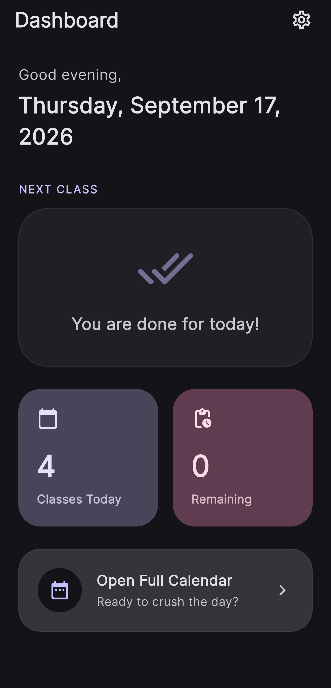
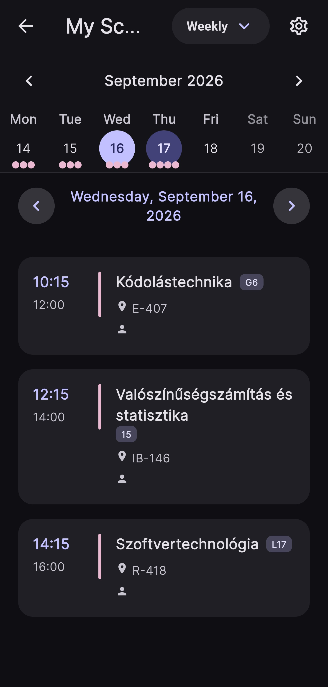
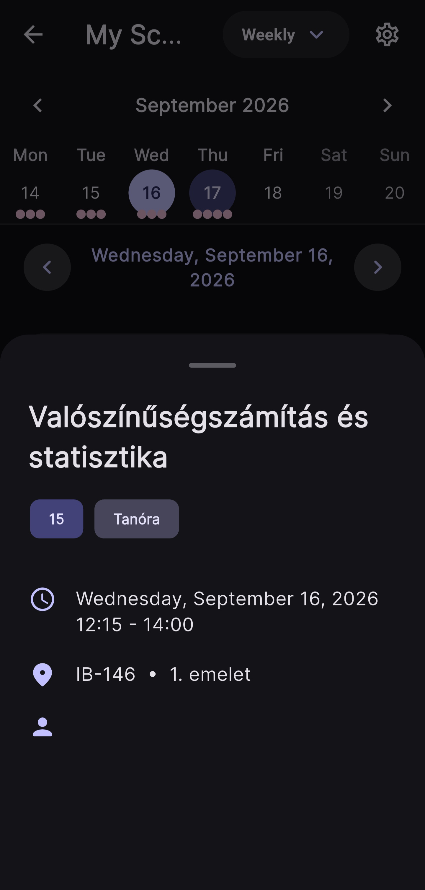
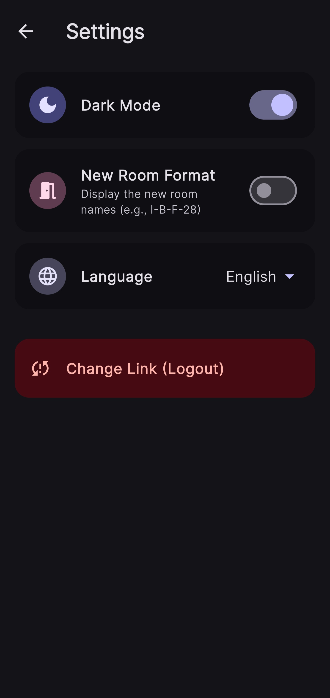

# Zsebtun

### Mobil órarend app, egyetemi Neptun tanulmányi rendszerhez.
### A modern mobile schedule application for the Neptun university system.

## Features

*   **Dashboard:** A sleek home screen that gives you a quick overview of your day, featuring daily class statistics and a live, calculating countdown to your next upcoming class.
*   **Interactive Calendar:** Switch between daily, weekly, and monthly views. Tap any class to open a detailed modal containing times, extracted room floors, and teachers.
*   **Offline Ready:** Your schedule is parsed and cached locally, ensuring full offline access after the initial sync.

## How It Works

1. **Export from Neptun:** Log into your university's Neptun web portal and export your calendar URL (`.ics` link).
2. **Sync in Zsebtun:** Paste the link into the app's setup screen.
3. **Enjoy:** The app downloads the raw ICS file, parses the unformatted text into clean, structured SQLite data, and displays it in a modern UI.


## Screenshots

| Dashboard | Calendar View | Class Details | Settings |
| :---: | :---: | :---: | :---: |
|  |  |  |  |

## Getting Started

### Prerequisites
*   [Flutter SDK](https://docs.flutter.dev/get-started/install)
*   Dart SDK
*   Android Studio

### Installation
1. Clone the repository:
2. Navigate to the project directory:
3. Install dependencies:
   ```bash
   flutter pub get
   ```
4. Run the app:
   ```bash
   flutter run
   ```

## License

[MIT License](LICENSE)

---
